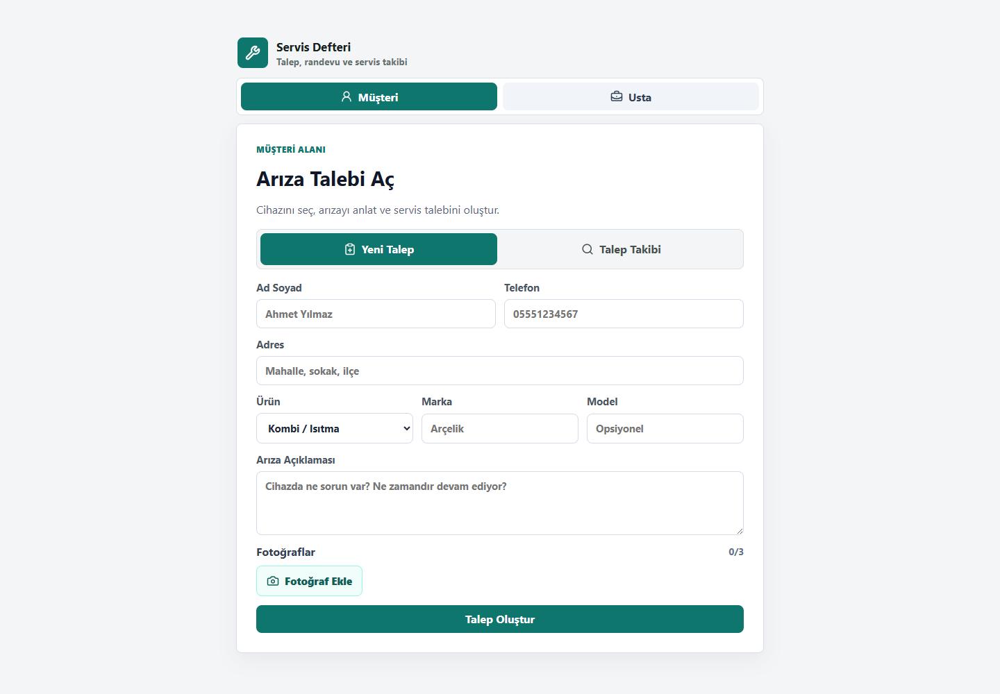

# Servis Defteri

<p align="center">
  <a href="https://github.com/Nurettin-Erdogan/servis-defteri/actions/workflows/api-ci.yml"></a>
  <a href="https://github.com/Nurettin-Erdogan/servis-defteri/actions/workflows/web-ci.yml"></a>
  <a href="https://github.com/Nurettin-Erdogan/servis-defteri/actions/workflows/mobile-ci.yml"></a>
  <a href="https://islik-cloud.vercel.app/"></a>
  
  <a href="LICENSE"></a>
</p>

**Servis talebinden ödemeye kadar tüm süreci tek yerde yöneten web + mobil + API ürünü.**

Servis Defteri, küçük servis işletmelerinin müşteri, randevu, servis talebi, iş durumu ve ödeme süreçlerini tek akışta toplar. Müşteri hesap açmadan servis talebi oluşturabilir ve takip koduyla durumunu izleyebilir; usta tarafında ise müşteri, iş ve ödeme yönetimi yapılabilir.

<p align="center">
  <a href="https://islik-cloud.vercel.app/"><strong>Canlı uygulamayı aç →</strong></a>
  &nbsp;·&nbsp;
  <a href="docs/demo-guide.md"><strong>Demo rehberi</strong></a>
  &nbsp;·&nbsp;
  <a href="docs/"><strong>Teknik belgeler</strong></a>
  &nbsp;·&nbsp;
  <a href="#testler"><strong>Testler</strong></a>
</p>

<p align="center">
  
</p>

## Kısa özet

| | |
| --- | --- |
| **Problem** | Küçük servis işletmelerinde müşteri, randevu, iş emri ve ödeme takibinin farklı kanallara dağılması |
| **Çözüm** | Aynı iş akışını web, mobil ve API üzerinde birleştiren uçtan uca servis yönetimi ürünü |
| **Web** | React, Vite, PWA |
| **Mobil** | Expo, SecureStore |
| **API** | Node.js, Express, Prisma, JWT |
| **Veritabanı** | PostgreSQL |
| **Güvenlik** | JWT, bcrypt, CORS allowlist, rate limiting, tenant izolasyonu |
| **DevOps** | GitHub Actions, Vercel, Render, EAS |

## Neler yapıyor?

### Müşteri tarafı

- Üye olmadan servis talebi oluşturma
- Kategori, marka, model, adres ve arıza açıklaması girme
- En fazla üç arıza fotoğrafı yükleme ve istemci tarafında sıkıştırma
- Takip kodu + telefon ile servis durumunu görüntüleme

### Usta tarafı

- Kayıt ve giriş
- Bugün, açık, acil, ödeme ve tamamlanan işler için panolar
- Müşteri ve servis talebi CRUD işlemleri
- Arama ve CSV dışa aktarma
- Ödeme durumlarını `ödenmedi / kısmi / ödendi` olarak takip etme

### Mobil dayanıklılık

- Oturum token'ını `expo-secure-store` ile saklama
- Yerel liste önbelleği
- LAN API algılama
- Bağlantı koptuğunda yeniden deneme akışı

## Mimari

```text
Müşteri / Usta
      │
      ├── Web: React + Vite PWA
      │
      └── Mobil: Expo
              │
              ▼
        Express REST API
              │
      ┌───────┴────────┐
      │                │
   Prisma           JWT/Auth
      │
      ▼
 PostgreSQL
```

Proje yapısı:

```text
apps/
├── api/      Express + Prisma REST API
├── web/      React + Vite PWA
└── mobile/   Expo mobil uygulama

docs/         demo ve teknik belgeler
```

## Mühendislik kararları

- **Tek backend, çoklu istemci:** Web ve mobil aynı API'yi kullanır; iş kuralları istemciler arasında dağılmaz.
- **Tenant izolasyonu:** Kullanıcıya ait müşteri ve servis kayıtları API katmanında kullanıcı bazlı sınırlandırılır.
- **Mobil oturum güvenliği:** Mobil token, düz depolama yerine SecureStore üzerinden saklanır.
- **Fotoğraf maliyeti:** Arıza fotoğrafları yükleme öncesinde sıkıştırılarak ağ ve depolama maliyeti azaltılır.
- **Bağlantı sorunları:** Mobil tarafta yerel önbellek ve yeniden deneme akışları bulunur.
- **Ayrı CI kapıları:** API, web ve mobil uygulama için ayrı GitHub Actions kontrolleri çalışır.

## Güvenlik

- JWT tabanlı kimlik doğrulama
- `bcrypt` ile parola hashleme (`cost 12`)
- CORS allowlist
- Auth ve public endpointler için rate limiting
- Güvenlik başlıkları
- Kullanıcı bazlı tenant izolasyonu
- Mobilde Keychain / Keystore tabanlı `expo-secure-store`

Web istemcisinde JWT şu anda `localStorage` içinde tutulur. Bu, vitrin/demo için kabul edilmiş bir trade-off'tur; `httpOnly` cookie'ye geçiş roadmap'tedir.

Ortam değişkenleri için örnek yapılandırma `apps/api/.env.example` dosyasındadır. Production secret'ları repoya eklenmemelidir.

## Canlı sistem

- Web: https://islik-cloud.vercel.app
- API: https://islik-cloud-api.onrender.com
- Health: https://islik-cloud-api.onrender.com/health
- Readiness: https://islik-cloud-api.onrender.com/ready

Render ücretsiz planda uykuya geçebildiği için ilk API isteği normalden uzun sürebilir. İstemciler bu duruma karşı daha uzun zaman aşımı ve yeniden deneme davranışı kullanır.

## Yerelde çalıştırma

Gereksinimler:

- Node.js
- Docker Desktop
- PostgreSQL veya Docker Compose ile sağlanan PostgreSQL

Repo kökünden:

```bash
docker compose -p islik-cloud up -d postgres
```

API:

```bash
cd apps/api
cp .env.example .env
npm ci
npx prisma migrate deploy
npm run dev
```

Web:

```bash
cd apps/web
npm ci
npm run dev
```

Windows'ta repo kökündeki `Servis Defteri Baslat.cmd` dosyası yerel geliştirme akışını kolaylaştırmak için kullanılabilir.

## Testler

API, web ve mobil uygulama için ayrı test/CI akışları bulunur.

```bash
cd apps/api && npm test
cd apps/web && npm test
cd apps/mobile && npm test
```

API tarafında Supertest entegrasyon testleri; web ve mobil tarafta istemci testleri CI üzerinde çalıştırılır.

## Canlı demo akışı

Canlı uygulamayı hızlı incelemek için:

1. Web uygulamasını aç.
2. Müşteri tarafında yeni servis talebi oluştur.
3. Takip kodunu kullanarak talebin durumunu görüntüle.
4. Usta tarafında oturum açarak müşteriyi, talebi ve ödeme durumunu yönet.

Daha ayrıntılı akış için [`docs/demo-guide.md`](docs/demo-guide.md) dosyasına bakılabilir.

## English

**Servis Defteri** is an end-to-end service operations product for small service businesses. Customers can create and track service requests without an account, while technicians manage customers, jobs, appointments and payment states through the same backend.

**Stack:** React + Vite PWA, Expo mobile, Node.js + Express + Prisma API, PostgreSQL, JWT authentication, GitHub Actions, Vercel and Render.

Live app: [islik-cloud.vercel.app](https://islik-cloud.vercel.app/)

## Sürüm

Mobil uygulama: `1.2.1` · Expo

## Lisans

Bu proje [MIT Lisansı](LICENSE) ile lisanslanmıştır. Güvenlik bildirimleri için `SECURITY.md` dosyasına bakılabilir.
